# Home Cooked

## What better way to travel than by eating with the locals?

https://vast-sea-28738.herokuapp.com/

https://github.com/mark-tomlinson-dev/HomeCooked

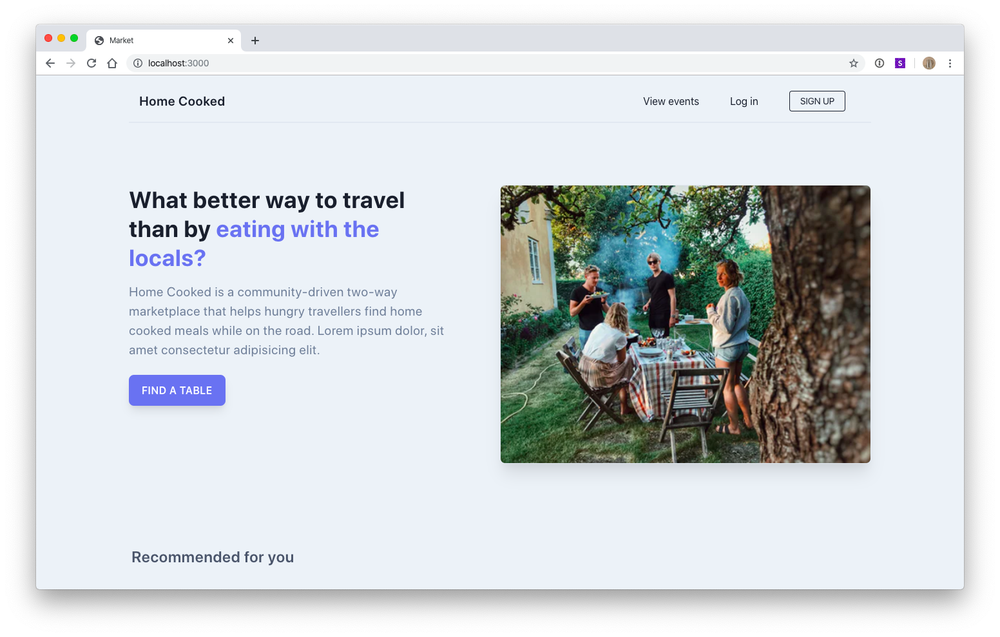
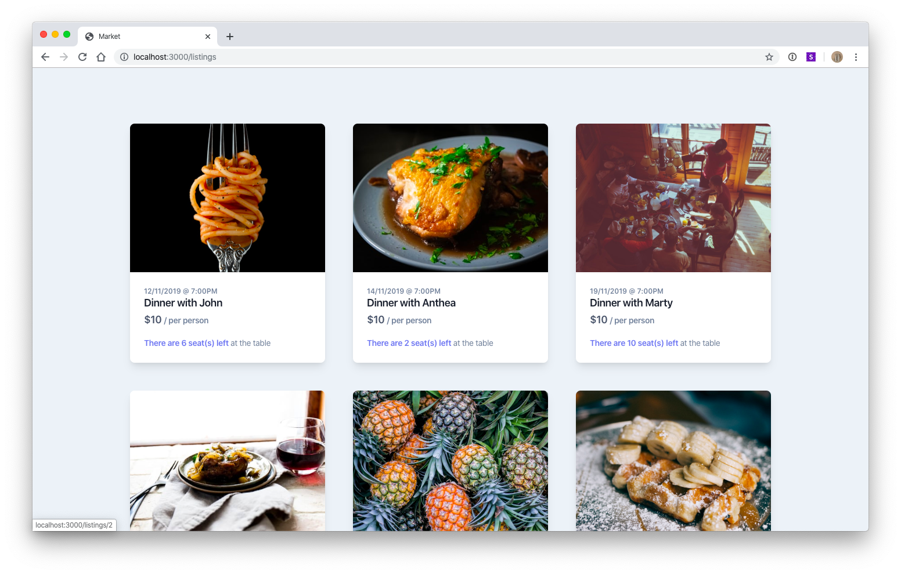
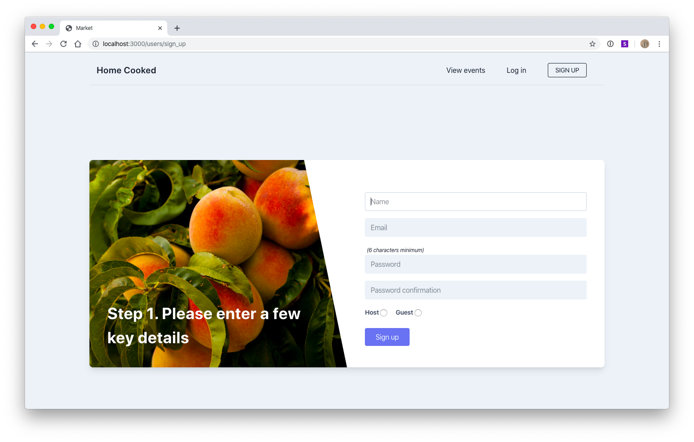
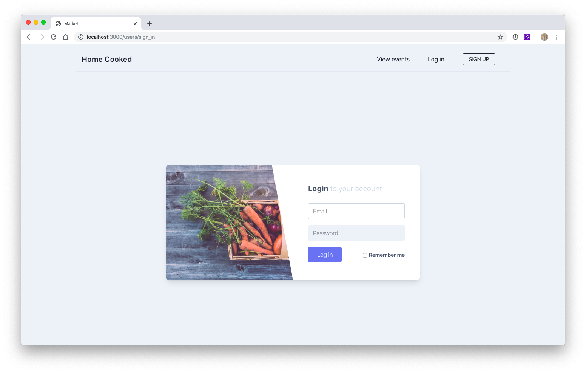


## About Home Cooked

Home Cooked is a community-driven two-way marketplace that helps hungry travellers find home cooked meals while on the road. While travelling is exhilirating it can often take a toll on your stomach. Restaurant meals tend to be rich and repetitive. Who, after a few weeks away, hasn't found themselves craving some proper food? Home cooked solves this problem by connecting travellers to hosts from all around the world. While hosts can take advantage of Home Cooked to make a bit of extra money, unlike services such as Uber and Airbnb, the primary purpose of the app is not commercial. Hosts sign up to Home Cooked not to make money but to meet new people and to help keep alive the arguably dying art of hospitality. For hosts and travellers alike, the contemporary world can be cold and inhospitable. Chance encounters are rare. It's possible to see an entire country without ever meeting a single local. Home Cooked changes that by putting willing and curious hosts in contact with hungry and curious guests.   


### Target Audience

While people in their 20s and 30s will most likely make up the majority of users, Home Cooked is not exclusively targetted at such users. The vision is for adults of any age to benefit from the app. 


### Tech Stack

Home Cooked is built and deployed using the following technologies:

- Ruby: An object-orientated programming language.
- Ruby on Rails: An open source, server-side web application framework.
- HTML: The standard markup language of all webpages and web applications.
- Tailwind CSS: A utility-based (rather than component-based), low-level CSS framework.
- PostgreSQL: An open source object-relational database system.
- Heroku: A cloud PaaS (Platform as a Service) that allows for quick and easy deployment.    


### Home Cooked Features

- *Browse:* Non-signed up users are free to browse available meals from around the world.
- *No ratings!* This may sound like a deficiency but it has been done on purpose. Rating systems encourage commercial motives and set users up as judges and observers rather than participants. While it can be argued that rating systems encourage actors to be good actors, there is considerable downside as well!
- *Become a host:* Users can create and host meals for other users, setting their own price and desired number of guests.
- *Become a guest:* Users can book and attend meals from hosts all around the world.
- *Stripe payments and transactions:* Facilitates secure credit card payment and records transaction details in database for reviews and future reference.
- *User profile dashboard:* Hosts and guests can can create, view and edit their profiles. Hosts can easily see a list of their upcoming events and, from there, update or cancel said events. Guests can easily see a list of their upcoming events for their own reference.
- *Devise authentication:* Provides a secure sign up and sign in authentication process for users.


## User Stories
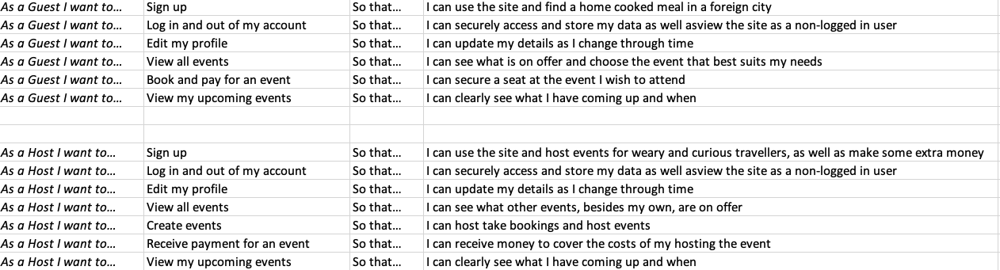


## Sitemaps


### Guests

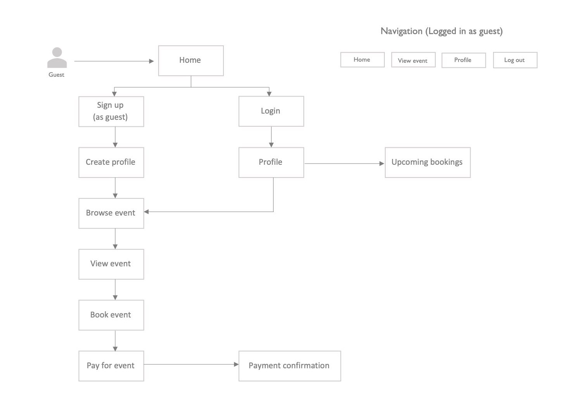

### Hosts

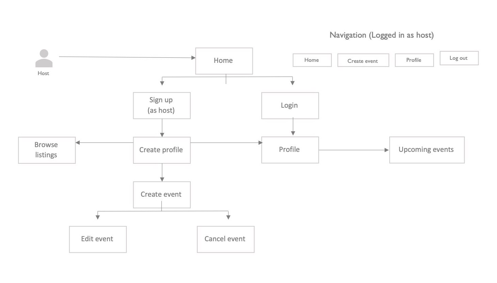

### Non-Signed Up

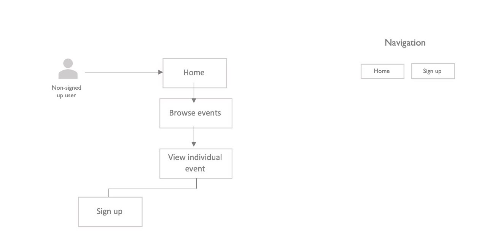

## ERD (Entity Relationship Diagram)

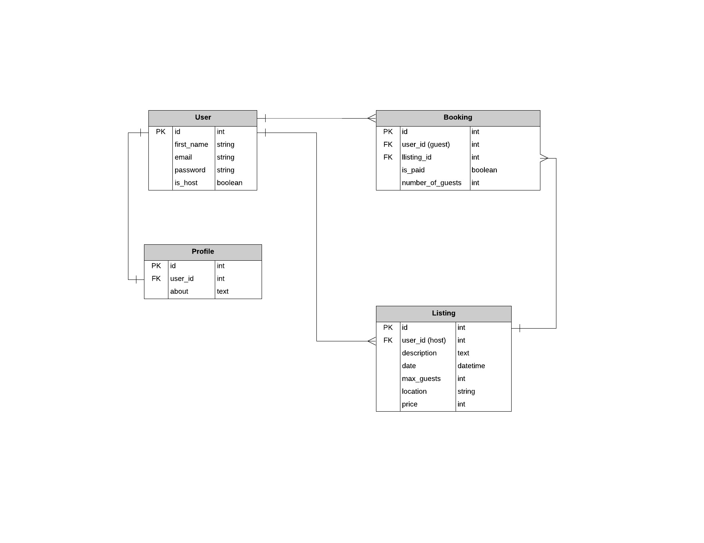

## High-Level Components (Abstractions)

As a Ruby on Rails web application, Home Cooked makes use of several high-level components or abstractions. Like other frameworks, Rails follows the model-view-controller (MVC) pattern as a way to organise code. 

- *Model:* A model in rails is that which accesses and manipulates data within the database. A model maps to a table. It is used to define relationships between tables as well as dependencies and validations. For example, I can specify in my 'user' model that certain rows in my user tables must not be left blank (null) - that their presence must be true, or I can specify a relationship between my 'user' model and my 'listing' model such that one user can have many listings.
- *View:* A view in rails is that which renders content to the user and relays user commands back to the controller. In the default configuation, views are .erb (embedded ruby) files, a file type that, as the name suggests, allows us to use ruby in our html. These are converted to html at run-time.
- *Controller:* A controller in rails has at least two basic functions. If the application is using a database, controllers query models for information. They then pass this information to the appropriate view. In Home Cooked, for example, a controller cancelling (destroying) a listing would need to query the listing model to find the appropriate listing to destory. It would then perform the designated action (destroy) before passing the information to be displayed by the view. It is important to note that controllers can perform multiple actions. In Home Cooked, for example, the listings controller destroys, edits and creates, among other things.

This is, of course, speaking in very general terms. A perhaps more specific example of the kind of high-level components used in this project is to speak briefly about Active Record. Active Record can be thought of as a layer that sits on top of SQL. It transpiles ruby into SQL commands (e.g. User.all => select * from "Users"). It uses ORM - Object/Relational Mapping - whereby tables map to classes, rows map to objects and columns map to object attributes. 

Another high-level component used in this project is Active Storage. Active Storage in Rails allows for the direct uploading of files from the client to cloud storage services like Amazon S3.


## Third-Party Services

Home Cooked makes use of a number of third-party services.

### Amazon S3

Amazon S3, a cloud-based storage solution, is used to collect and store uploaded user images. (Home Cooked asks all users to upload a profile image and hosts to upload an event image when they create an event).  

### Stripe 

Stripe is integrated into the application in order to allow users to make and receive payments through the application itself. From the 'PAY' button, users are redirected to Stripe to enter their credit card details. From there they are redirected back to the successful payment page in the application.  

### Devise

The Devise gem is used for authentication and in order to securely store user details such as name, email, and password. Devise also generates a User model, associated controllers, as well as views, out of the box. In other words, it handles the tasks of signing up and signing in without the need for extensive manual configuration. 


## Active Record Associations

One of the most important mechanisms of Active Record is its ability to represent associations between models. By creating such associations it becomes relatively easy to perform common operations across different tables in a database.

Database relationships typically fall into one of three main types: one-to-one, one-to-many, and many-to-many. One-to-one relationships occur when a record in a table has one and only one counterpart in a second table. One-to-many relationships occur when a record in one table corresponds to one or many records in a second table. As the name suggests, those records in the second table only refer to one record in the first table. Many-to-many relationships occur when one or more records in the first table refer to one or more records in the second table. Many-to-many relationships are typically handled by a third table, commonly referred to as a join table. 

Home cooked makes use of four tables, which correspond to four Active Record models: User, Profile, Listing, Booking.
   
User
````
has_many :listings, dependent: :destroy
has_many :bookings, dependent: :destroy
has_one :profile
````
Profile
````
belongs_to :user
has_one_attached :picture
````
Listing
````
belongs_to :user
has_many :bookings
has_one_attached :picture
````
Booking
````
belongs_to :user
belongs_to :listing
````

Here we can see that by the most common database relationship in Home Cooked is the one-to-many. One user has many listings and bookings, while each listing or booking belongs to one user (not necessarily the same user). One listing has many bookings, while each booking belongs to one listing. A one-to-one relationship is in operation between User and Profile. One user has one profile and one profile has one user. Lastly, Active Storage provides us with the has-one-attached relationship (a form of one-to-one). One profile has one picture and one picture belongs to one profile; one listing has one picture and one picture has one listing.


## Database Relations

As mentioned above, Home Cooked makes use of four models which correspond to four tables in its database: User, Profile, Listing, and Booking. Each table has a number of columns. Each column is assigned a particular data type. It is crucial in planning a project such as this that one think carefully about the kinds of data one wishes to store before seeding a database, or collecting data out in the wild, not least of all because different ruby methods, and Active Record quirks, are available to different data types. It is also crucial to model the associations between tables according to the kinds of operations you wish to perform.

Home Cooked aims to keep things relatively straightforward. In addition to some other fields, the User table stores the following data: email as string, password as string, is_host as a boolean, and first_name as string. Perhaps the most interesting field is the is_host field. All fields are crucial to the effective functioning of the app but is_host plays an important role in making sure the app functions as a two-way marketplace. At sign up, users choose to be either a host or guest. Their choice is recorded in the User table is_host field as either true or false. From there the app is able to determine what sort of information and operations to make available. Even something as simple as site navigation is determined thereby. 

The Profile table stores a user's bio (about), which they can enter as text. It contains user_id as a foreign key, which is what creates the association between the Profile table and the User table. 

The largest table is the Listing table. Importantly, it again contains user_id as a foreign key, allowing listings to be associated with users. It contains a title field to be stored as a string, a desription field to be stored as text, a max_guests field to be stored as an integer, a price field to also be stored as an integer, as a well as a date for the listing (to be stored as a datetime rather than just date) and a location (string).

Last is the Booking table. The Booking table contains two foreign keys: user_id and listing_id. The user_id foreign key is what allows a booking to be associated with a user and a user to have or make many bookings. The listing_id foreign key is what allows a booking to be associated with a listing and a listing to have many bookings. The Booking table also contains two additional fields: is_paid (boolean) and number_of_guests (integer). These will be crucial in future iterations of the application.


## Project Management & Task Tracking

Tasks were tracked and allocated (to me!) throughout the project using a Trello board. I tried to keep things clean this time. I kep track of bugs that needed to be fixed and such like in a notebook and kept Trello purely for ticking off big-ticket items. This seemed to work a bit better for me.

### The beginnings...
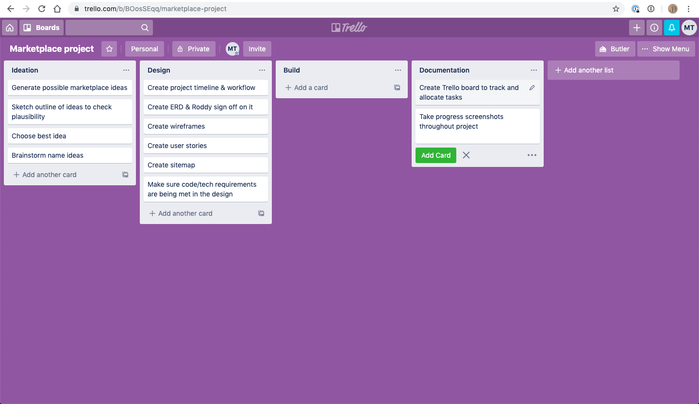
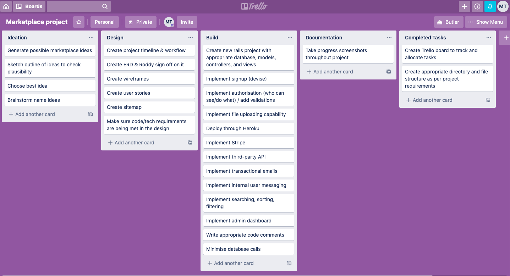
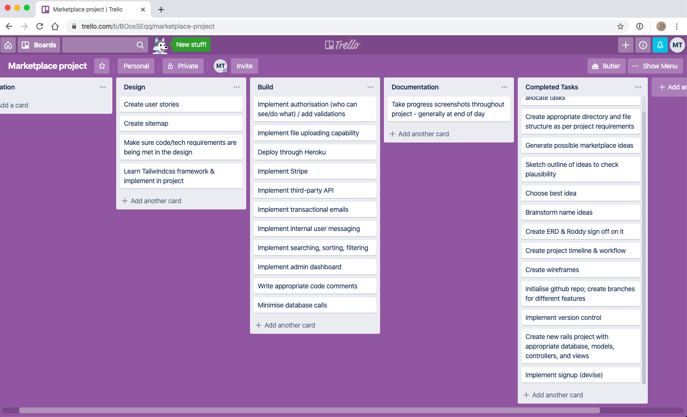

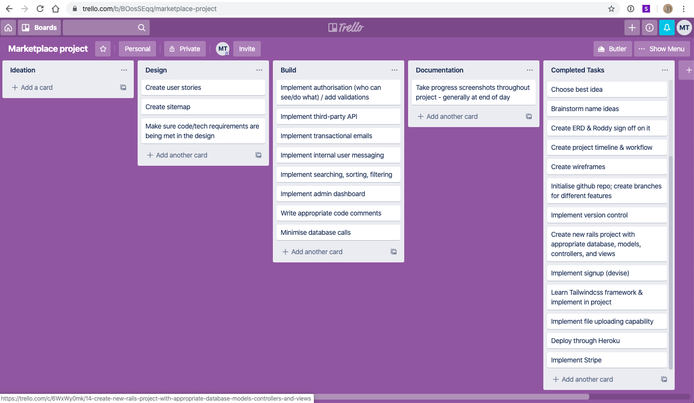
### Getting there...
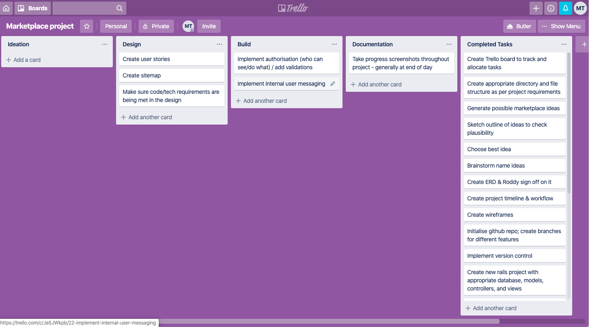
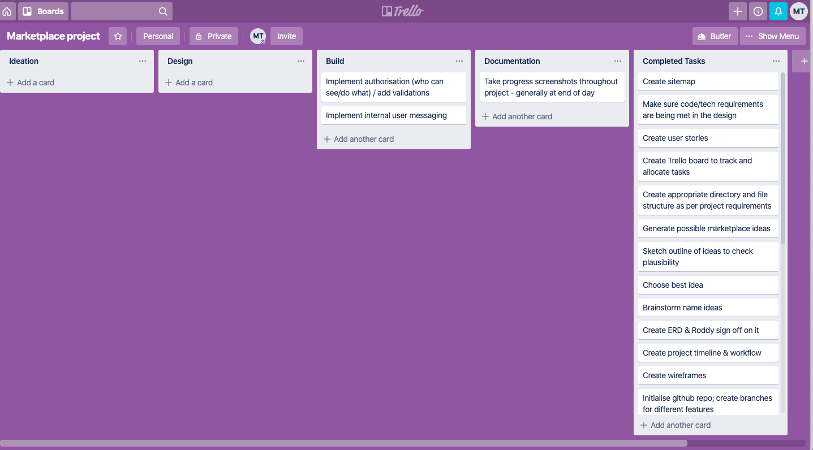
### And done! 
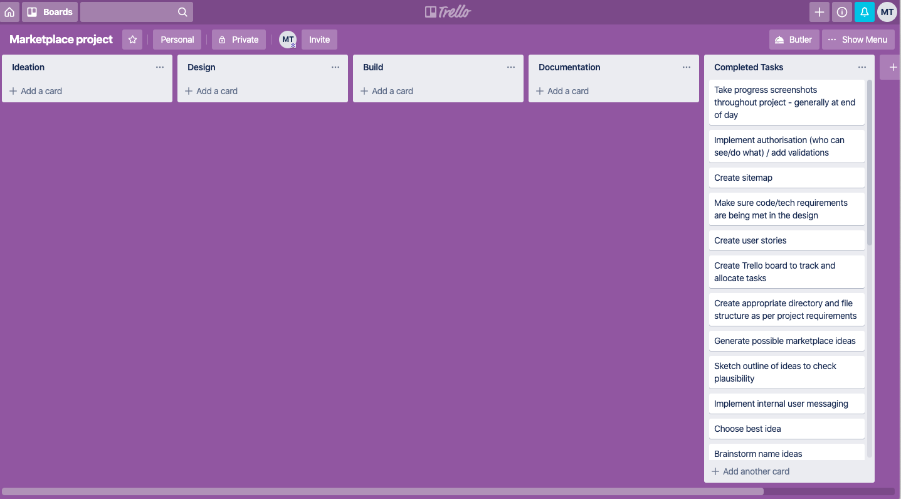
